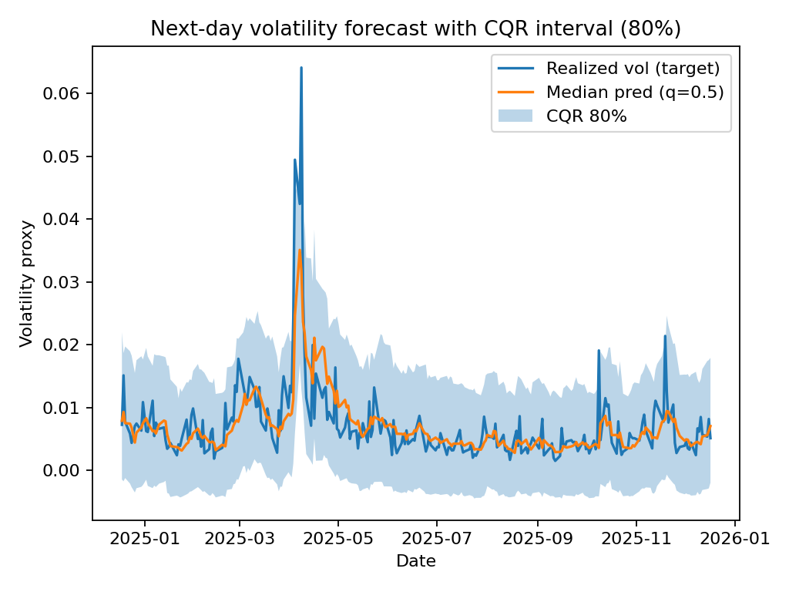
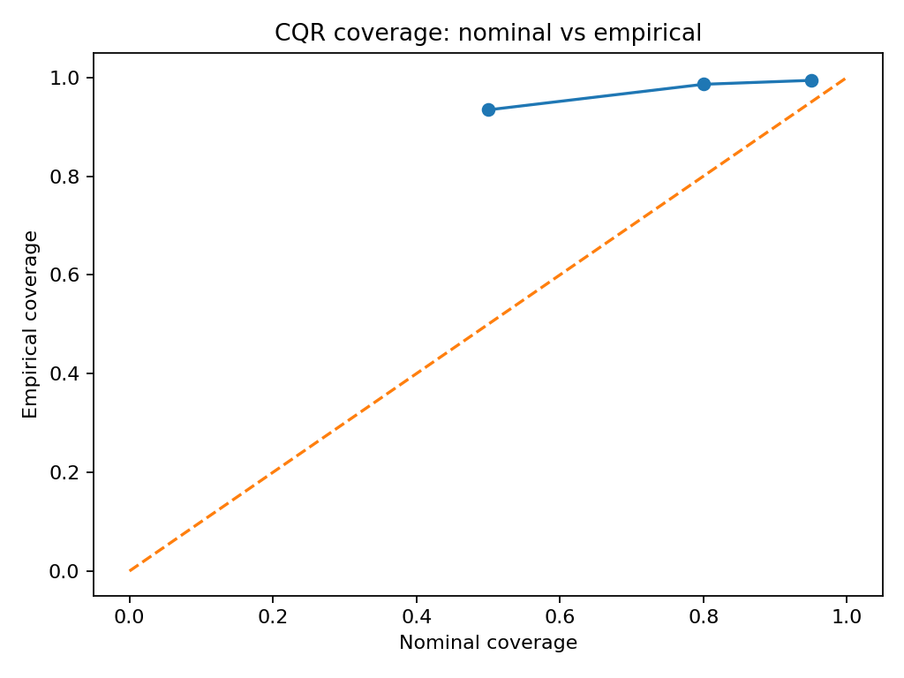

# Calibrated Volatility Forecasting with Quantile Regression + Conformal Prediction (CQR)

Probabilistic next-day volatility forecasting for **SPY** using a clean, reproducible **time-series** pipeline. The project trains **quantile regression** models and applies **Conformalized Quantile Regression (CQR)** to produce **calibrated prediction intervals**, evaluated under a strict walk-forward split (train → calibration → test).

---

## Why this project

In financial ML, point forecasts are often less useful than **uncertainty-aware forecasts**. This repo focuses on:

- **Time-series-safe evaluation** (no leakage)
- **Predictive intervals** via quantile regression
- **Calibration** using conformal prediction (CQR)
- Clear metrics: **coverage**, **interval width**, and **pinball loss**

---

## What’s included

- Data download (`yfinance`) for daily OHLCV
- Feature generation from returns + range/volatility proxies
- Quantile models (`HistGradientBoostingRegressor` with quantile loss)
- CQR calibration and test evaluation
- Artifacts: JSON results, CSV predictions, and diagnostic plots

---

## Project structure

```
vol_forecast_cqr/
  data/
    spy.csv
  artifacts/
    results.json
    predictions.csv
    fig_interval.png
    fig_coverage.png
  src/
    data_fetch.py
    features.py
    models.py
    train_eval.py
  requirements.txt
```

---

## Quickstart

### 1) Create a virtual environment and install dependencies

**Windows (Command Prompt):**
```bat
python -m venv .venv
.\.venv\Scripts\activate.bat
python -m pip install --upgrade pip
pip install -r requirements.txt
```

**macOS/Linux:**
```bash
python3 -m venv .venv
source .venv/bin/activate
python -m pip install --upgrade pip
pip install -r requirements.txt
```

---

### 2) Download data (SPY daily OHLCV)

```bat
python -m src.data_fetch --ticker SPY --start 2005-01-01 --out data\spy.csv
```

This writes `data/spy.csv`.

---

### 3) Train, calibrate, and evaluate (walk-forward)

```bat
python -m src.train_eval --data data\spy.csv --out_dir artifacts --test_years 2 --cal_years 1
```

Outputs:
- `artifacts/results.json`
- `artifacts/predictions.csv`
- `artifacts/fig_interval.png`
- `artifacts/fig_coverage.png`

---

## Method overview

### Target
We forecast a **next-day volatility proxy** computed from daily OHLC (Parkinson-style range-based estimator). The supervised target is:

- `y_t = volatility_proxy(t+1)`  
  (predict tomorrow’s volatility from information available today)

### Features
- Lagged daily returns (1/2/5/10)
- Rolling return mean/std (5/10/21/63)
- Lagged volatility proxy + rolling mean/std
- Log(high/low) range
- Log volume (if available)
- Day of week

### Models
For each desired nominal coverage, we train a **pair of quantile models**:

- 50% interval: (q=0.25, q=0.75)
- 80% interval: (q=0.10, q=0.90)
- 95% interval: (q=0.025, q=0.975)

We also train a median model (q=0.5) for plotting.

### Calibration: Conformalized Quantile Regression (CQR)
On the calibration window, compute conformity scores:

\[
s_i = \max(y_i - \hat{q}_{lo}(x_i),\; \hat{q}_{hi}(x_i) - y_i)
\]

Then expand the test-set quantile interval by \( \hat{q} \) (a quantile of the calibration scores) to obtain a calibrated interval.

---

## Results (plots)

### Calibrated interval over time


### Nominal vs empirical coverage


---

## Evaluation outputs

We report:

- **Empirical coverage** vs nominal coverage (on the test set)
- **Average interval width**
- **Pinball loss** (for uncalibrated quantile predictions; diagnostic)

Key outputs:
- `artifacts/results.json`: split dates + metrics + conformal adjustments
- `artifacts/predictions.csv`: test-set predictions and calibrated intervals

---

## Reproducibility notes

- The pipeline uses a strict **time-based split** (no random shuffling).
- All outputs are written to `artifacts/` so results are easy to inspect and share.

---

## Next steps / extensions

- Multi-asset extension (e.g., sector ETFs) to study cross-sectional calibration stability
- Regime features (trend, drawdown, macro proxies) and stress-period diagnostics
- Alternative targets (realized volatility from intraday data, GARCH baselines)
- Calibrate to economic objectives (risk targeting, exceedance rates, VaR-style backtests)

---

## License

MIT 
